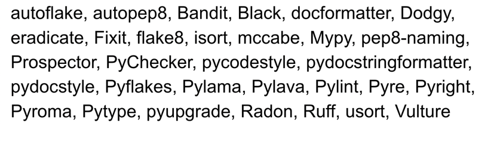

# Linter & Formatter & Code Quality Tools

Here we'll introduce the linter, formatter and code quality tools used in the project.
We won't introduce the tools in detail, but just give a brief introduction and some examples,
which are extracted from the official docs.


## Black, MyPy, Isort, Flake8(Recommended)
Now in used linters and formatters are `Black`, `MyPy`, `Isort`, `Flake8`, which are managed by `pre-commit` together.

!!! note "Ruff V.S. Isort & Flake8"

    Until now, I don't use `Ruff` in the project,
    but I think it is a good tool to replace `Isort` and `Flake8`.
    In the future version, I will try to use `Ruff` to replace `Isort` and `Flake8`.

## Black, MyPy and Ruff(Recommended)

After some reading[^1] and communication[^3], I think using `Black`, `MyPy` and `Ruff` maybe a better choice.
I'll try to explore Ruff later and try to use it in the project.


## Swiss Army Knife :-)

???+ quote "PyCon US 2023 - An Overview of the Python Code Tool Landscape 2023"
    

    There are a few of them out there. I really didn't understand what I was getting myself into.
    I had heard of some of them, but many of them have similar names and some I had never heard of,
    and I found the whole thing really confusing.[^1] - Al Sweigart


???+ note "The tools' categories"

    We use the categories defined by Al Sweigart in his blog[^2].


### [PEP8](https://peps.python.org/pep-0008/) -> [pycodestyle](https://github.com/PyCQA/pycodestyle)

???+ quote "pep8 was **renamed** to pycodestyle"

    pycodestyle is a tool to check your Python code against some of the style conventions in PEP 8...
    This package used to be called pep8 but was **renamed** to pycodestyle to reduce confusion.
    - pycodestyle doc

- PEP 8 – Style Guide for Python Code
- pycodestyle (formerly called pep8) - Python style guide checker

!!! note "We wouldn't use the pycodestyle package directly"

    We wouldn't use the pycodestyle package directly,
    but we would use the `flake8` package which is a wrapper around pycodestyle,
    and it also includes other tools like `pyflakes`(static analysis tool) and `mccabe`(complexity checker).


### [Isort](https://github.com/PyCQA/isort): Style Linter for Import Statements

???+ quote "isort your imports, so you don't have to."

    isort is a Python utility / library to **sort imports alphabetically**,
    and automatically separated into sections and by type.
    It provides a command line utility, Python library and plugins for various editors to quickly sort all your imports.
    It requires Python 3.7+ to run but supports formatting Python 2 code too.
    - isort doc

The example from isort doc is very clear:

Before isort:
```python
from my_lib import Object

import os

from my_lib import Object3

from my_lib import Object2

import sys

from third_party import lib15, lib1, lib2, lib3, lib4, lib5, lib6, lib7, lib8, lib9, lib10, lib11, lib12, lib13, lib14

import sys

from __future__ import absolute_import

from third_party import lib3

print("Hey")
print("yo")
```

After isort:
```python
from __future__ import absolute_import

import os
import sys

from third_party import (lib1, lib2, lib3, lib4, lib5, lib6, lib7, lib8,
                         lib9, lib10, lib11, lib12, lib13, lib14, lib15)

from my_lib import Object, Object2, Object3

print("Hey")
print("yo")

```

### [Flake8](https://github.com/PyCQA/flake8): Error & Style Linter, Complexity Analysis

For example, we have a file `hello.py`:

!!! example "hello.py"

    ```python
    print ( "Hello, World" )
    ```

After running `flake8 hello.py`, we got the following result:

```bash
hello.py:1:6: E211 whitespace before '('
hello.py:1:8: E201 whitespace after '('
hello.py:1:23: E202 whitespace before ')'
hello.py:1:25: W292 no newline at end of file
```

!!! warning "Break code style is easy in Python"

    We got four code style mistakes in a one line hello world code.

We can see that the flake8 only check the code style, but not fix it.
Later, we'll show how to use `black` to fix the code style automatically.


### [Black](https://github.com/psf/black): Code Formatter

!!! note "Black"

    Black is a PEP 8 compliant opinionated formatter with its own style.

Use black is simple, just run `black .` in the project root directory.
We can also use black on single file, just run `black hello.py`.

With the file `hello.py`:

!!! example "hello.py"

    ```python
    print ( "Hello, World" )
    ```

After running `black hello.py`, the code style is fixed:

```python
print("Hello, World")
```

Meantime, black also give us a statistics log:

```bash
reformatted hello.py

All done! ✨ 🍰 ✨
1 file reformatted, N files left unchanged.
```


### [Ruff](https://github.com/astral-sh/ruff): Linter & Formatter

!!! note "Ruff is NOT in the template until now"

    Actually, I don't use `Ruff` in practice.
    I'll try to explore Ruff later and try to use it in the project.

As just mentioned before, many people recommend to use `Ruff`, because it's a very cool tool.

- It's **VERY** fast[^4]

<center>

</center>


### [Mypy](https://github.com/python/mypy): Type Checker
We use an example from official
[docs](https://mypy.readthedocs.io/en/stable/getting_started.html#dynamic-vs-static-typing) of mypy.

!!! example "greeting"

    === "Without type hint"

        A function without type annotations is considered to be **dynamically typed** by mypy:

        ```python
        def greeting(name):
            return 'Hello ' + name

        greeting(123)
        greeting(b"Alice")
        ```
        By default, mypy will not type check dynamically typed functions.
        This means that with a few exceptions, mypy will not report any errors with regular unannotated Python.

    === "With type hint"

        ```python
        def greeting(name: str) -> str:
            return 'Hello ' + name

        greeting(3)
        ```
        This function is now **statically typed**:
        mypy will use the provided type hints to detect incorrect use of the greeting function and
        incorrect use of variables within the greeting function.

        After run `mypy hello.py`, we got the following result:

        ```bash
        hello.py:5: error: Argument 1 to "greeting" has incompatible type "int"; expected "str"  [arg-type]
        Found 1 error in 1 file (checked 1 source file)
        ```


### [Pre-commit](https://pre-commit.com/)
Pre-commit can be treated as a linter manager, it can manage the linters in the project and run them in a batch.


!!! example "Pre-commit run result"

    === "Config"

        ```yaml
        repos:
          - repo: https://github.com/pre-commit/pre-commit-hooks
            rev: v4.5.0
            hooks:
              - id: check-toml
              - id: check-yaml
              - id: end-of-file-fixer
              - id: trailing-whitespace
                exclude: .+\.csv
              - id: mixed-line-ending
                args: [--fix=lf]
          - repo: https://github.com/psf/black
            rev: 23.11.0
            hooks:
              - id: black
          - repo: https://github.com/pycqa/isort
            rev: 5.12.0
            hooks:
              - id: isort
                args: ["--profile", "black"]
          - repo: https://github.com/pycqa/flake8
            rev: 6.1.0
            hooks:
              - id: flake8
          - repo: https://github.com/pre-commit/mirrors-mypy
            rev: v1.7.1  # Use the sha / tag you want to point at
            hooks:
              - id: mypy
                args: [--strict, --ignore-missing-imports]
        ```

    === "Run result"

        ```bash
        check toml...............................................................Passed
        check yaml...............................................................Passed
        fix end of files.........................................................Passed
        trim trailing whitespace.................................................Passed
        mixed line ending........................................................Passed
        black....................................................................Passed
        isort....................................................................Passed
        flake8...................................................................Passed
        mypy.....................................................................Passed
        ```


???+ tip "Pre-commit quick start (with Poetry)"

    - Fellow the `Quick start` in [https://pre-commit.com/](https://pre-commit.com/#quick-start)
    - Run `poetry add pre-commit` to install `pre-commit` into the project
    - Run `pre-commit install` to install the hooks
    - Run `poetry shell` into the created python venv environment
    - Run `pre-commit run -a` to check all the files in the project


### SonarLint
[SonarLint](https://www.sonarsource.com/products/sonarlint/)


[//]: # (footnotes:)
[^1]: [PyCon US 2023 - An Overview of the Python Code Tool Landscape 2023](https://docs.google.com/presentation/d/1kHK5M4GpB_qSQO3aGbVzUtWaSwqsEaMqikuIeM4VDjk/edit?pli=1#slide=id.g22f3767756a_0_60)
[^2]: [Python Linter Comparison 2022](https://inventwithpython.com/blog/2022/11/19/python-linter-comparison-2022-pylint-vs-pyflakes-vs-flake8-vs-autopep8-vs-bandit-vs-prospector-vs-pylama-vs-pyroma-vs-black-vs-mypy-vs-radon-vs-mccabe/)
[^3]: [Somewhat-modern Python](https://pawamoy.github.io/posts/somewhat-modern-python-development/)
[^4]: [Ruff](https://docs.astral.sh/ruff/)
