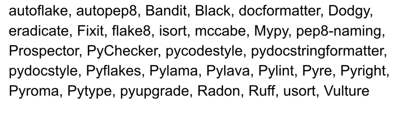

# Linter & Formatter & Code Quality Tools

Here we'll introduce the linter, formatter and code quality tools used in the project.
We won't introduce the tools in detail, but just give a brief introduction and some examples,
which are extracted from the official docs.


## Ruff and ty (Recommended)
- Linter & Formatter: [Ruff](https://github.com/astral-sh/ruff)
- Type Checker: [ty](https://github.com/astral-sh/ty)


## Swiss Army Knife :-)

???+ quote "PyCon US 2023 - An Overview of the Python Code Tool Landscape 2023"
    

    There are a few of them out there. I really didn't understand what I was getting myself into.
    I had heard of some of them, but many of them have similar names and some I had never heard of,
    and I found the whole thing really confusing. - Al Sweigart


???+ note "The tools' categories"

    We use the categories from Al Sweigart's overview of the Python code-tool landscape.


### [PEP8](https://peps.python.org/pep-0008/) -> [pycodestyle](https://github.com/PyCQA/pycodestyle)

???+ quote "pep8 was **renamed** to pycodestyle"

    pycodestyle is a tool to check your Python code against some of the style conventions in PEP 8...
    This package used to be called pep8 but was **renamed** to pycodestyle to reduce confusion.
    - pycodestyle doc

- PEP 8 – Style Guide for Python Code
- pycodestyle (formerly called pep8) - Python style guide checker

!!! note "We wouldn't use the pycodestyle package directly"

    We wouldn't use the pycodestyle package directly,
    but we would use the `flake8` package which is a wrapper around pycodestyle,
    and it also includes other tools like `pyflakes`(static analysis tool) and `mccabe`(complexity checker).


### [Isort](https://github.com/PyCQA/isort): Style Linter for Import Statements

???+ quote "isort your imports, so you don't have to."

    isort is a Python utility / library to **sort imports alphabetically**,
    and automatically separated into sections and by type.
    It provides a command line utility, Python library and plugins for various editors to quickly sort all your imports.
    It requires Python 3.7+ to run but supports formatting Python 2 code too.
    - isort doc

The example from isort doc is very clear:

Before isort:
```python
from my_lib import Object

import os

from my_lib import Object3

from my_lib import Object2

import sys

from third_party import lib15, lib1, lib2, lib3, lib4, lib5, lib6, lib7, lib8, lib9, lib10, lib11, lib12, lib13, lib14

import sys

from __future__ import absolute_import

from third_party import lib3

print("Hey")
print("yo")
```

After isort:
```python
from __future__ import absolute_import

import os
import sys

from third_party import lib1, lib2, lib3, lib4, lib5, lib6, lib7, lib8, lib9, lib10, lib11, lib12, lib13, lib14, lib15

from my_lib import Object, Object2, Object3

print("Hey")
print("yo")
```

### [Flake8](https://github.com/PyCQA/flake8): Error & Style Linter, Complexity Analysis

For example, we have a file `hello.py`:

!!! example "hello.py"

    ```python
    print("Hello, World")
    ```

After running `flake8 hello.py`, we got the following result:

```bash
hello.py:1:6: E211 whitespace before '('
hello.py:1:8: E201 whitespace after '('
hello.py:1:23: E202 whitespace before ')'
hello.py:1:25: W292 no newline at end of file
```

!!! warning "Break code style is easy in Python"

    We got four code style mistakes in a one line hello world code.

We can see that the flake8 only check the code style, but not fix it.
Later, we'll show how to use `black` to fix the code style automatically.


### [Black](https://github.com/psf/black): Code Formatter

!!! note "Black"

    Black is a PEP 8 compliant opinionated formatter with its own style.

Use black is simple, just run `black .` in the project root directory.
We can also use black on single file, just run `black hello.py`.

With the file `hello.py`:

!!! example "hello.py"

    ```python
    print("Hello, World")
    ```

After running `black hello.py`, the code style is fixed:

```python
print("Hello, World")
```

Meantime, black also give us a statistics log:

```bash
reformatted hello.py

All done! ✨ 🍰 ✨
1 file reformatted, N files left unchanged.
```


### [Ruff](https://github.com/astral-sh/ruff): Linter & Formatter


As just mentioned before, many people recommend to use `Ruff`, because it's a very cool tool.

- It's **VERY** fast.

<center>

</center>


### [ty](https://github.com/astral-sh/ty): Type Checker

[ty](https://github.com/astral-sh/ty) is an extremely fast Python type checker written in Rust, from the creators of Ruff.

!!! example "greeting"

    === "Without type hint"

        A function without type annotations is considered to be **dynamically typed**:

        ```python
        def greeting(name):
            return "Hello " + name


        greeting(123)
        greeting(b"Alice")
        ```
        By default, ty will not type check dynamically typed functions.

    === "With type hint"

        ```python
        def greeting(name: str) -> str:
            return "Hello " + name


        greeting(3)
        ```
        This function is now **statically typed**:
        ty will use the provided type hints to detect incorrect use of the greeting function and
        incorrect use of variables within the greeting function.

        After running `ty check hello.py`, we get type errors for incorrect usage.


### [prek](https://prek.j178.dev/)

prek manages repository hooks with a native TOML configuration. This template
uses its built-in Rust hooks for file hygiene and local project tools for Ruff
and ty, so it does not clone remote hook repositories or create separate hook
environments.

!!! example "prek configuration"

    ```toml
    [[repos]]
    repo = "builtin"
    hooks = [
        { id = "check-toml" },
        { id = "check-yaml" },
        { id = "end-of-file-fixer" },
        { id = "trailing-whitespace" },
        { id = "mixed-line-ending", args = ["--fix=lf"] },
    ]

    [[repos]]
    repo = "local"
    hooks = [
        { id = "ruff-check", name = "ruff check", entry = "uv run ruff check", language = "system", types_or = ["python", "pyi"] },
        { id = "ruff-format", name = "ruff format", entry = "uv run ruff format", language = "system", types_or = ["python", "pyi"] },
        { id = "ty", name = "ty check", entry = "uv run ty check", language = "system", pass_filenames = false, always_run = true },
    ]
    ```

Install the Git hooks and check the whole repository:

```bash
uv run prek install
uv run prek run --all-files
```


### SonarLint
[SonarLint](https://www.sonarsource.com/products/sonarlint/)

### SQLFluff

[SQLFluff](https://sqlfluff.com/) is a linter for SQL code.

!!! quote "SQLFluff"

    SQLFluff is an open source, dialect-flexible and configurable SQL linter. Designed with ELT applications in mind, SQLFluff also works with Jinja templating and dbt. SQLFluff will auto-fix most linting errors, allowing you to focus your time on what matters.
    - SQLFluff doc
