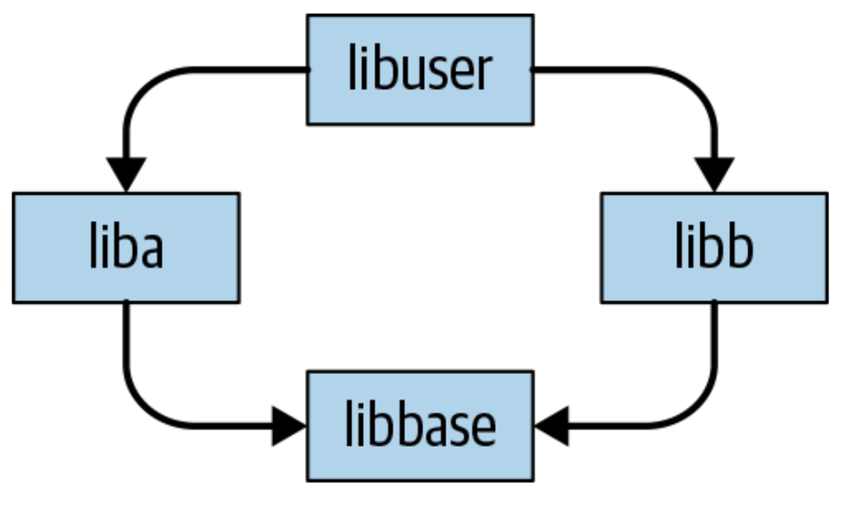

# Package Management

## Why, What and How
Most of the illustration is excerpted from *Software Engineering from Google*[@google-sre].

### Why
To be honest, it is almost impossible to avoid importing dependencies in our projects.
Nowadays, Open Source Software (OSS) provides us with many useful libraries/packages/dependencies,
which can save us time and let us only focus on business logic.

### What

!!! note "Most challenging problems in software engineering"

    - Dependency management—the management of networks of libraries, packages, and
      dependencies that we don't control—is one of the least understood and **most
      challenging problems in software engineering**.

      - The trick isn't just finding
        a way to manage one dependency—the trick is how to manage **a network of
        dependencies and their changes over time**.

- Conflicting Requirements and Diamond Dependencies

{: style="height:200px;width:300px"}

!!! example "Diamond Dependencies Example"

    In this simplified model, **libbase** is used by both **liba** and **libb** , and **liba** and **libb**
    are both used by a higher-level component **libuser** . If **libbase** ever introduces an
    incompatible change, there is a chance that **liba** and **libb** , as products of separate
    organizations, don't update simultaneously. If **liba** depends on the new libbase version
    and **libb** depends on the old version, there’s no general way for **libuser** (aka
    your code) to put everything together.

### How

#### Static Dependency

The simplest way to ensure stable dependencies is to never change them: no API
changes, no behavioral changes, nothing.

???+ note "False over a long enough time period"

    The downside to this model is that, over a long enough time period, it is false, and
    there isn't a clear indication of exactly how long you can pretend that it is legitimate.
    We don’t have long-term early warning systems for security bugs or other critical
    issues that might force you to upgrade a dependency—and because of chains of
    dependencies, a single upgrade can in theory become a forced update to your entire
    dependency network.

!!! warning "`requirements.txt` with `==`"

    If you use `==`(or don't have a version specification at all) in `requirements.txt`,
    you are actrully using the Static Dependency Model.

#### Semantic Versioning

!!! tip "The de facto standard"

    The de facto standard for “how do we manage a network of dependencies today?” is
    semantic versioning (SemVer). 6 SemVer is the nearly ubiquitous practice of repre‐
    senting a version number for some dependency (especially libraries) using three
    decimal-separated integers, such as 2.4.72 or 1.1.4.

With the SemVer separation of major/minor/patch versions, the assumption is that a
version requirement can generally be expressed as “anything newer than,” barring
API-incompatible changes (major version changes).

??? note "Two another methods in the SRE book"

    The are two another dependencies management methods in the book,
    named with "Bundled Distribution Models" and "Live at Head".
    They have little relation to the topic here, so we wouldn't expand them here.

### uv(Recommended)
[uv](https://github.com/astral-sh/uv) is a VERY fast Python package installer and resolver.
It speeds up the dependency resolution & installation process a lot.

!!! tip "uv"

    uv now is in rapid development and is not yet production ready.
    So we recommend you to use Poetry for now.
    But uv is a promising package manager which will be the game changer in the future, IMHO.
    So keep an eye on it and try it if you can!

## Alternatives

???+ tip "Comparison of Python package managers"

    - [Python has too many package managers](https://dublog.net/blog/so-many-python-package-managers/)

### Poetry

[Poetry](https://python-poetry.org/) is a tool for dependency management and packaging in Python.
It allows you to declare the libraries your project depends on, and it will manage (install/update) them for you.

!!! note "Poetry"

    Poetry is a tool for **dependency management** and **packaging** in Python.
    It allows you to declare the libraries your project depends on and it will manage (install/update) them for you.
    Poetry offers a **lockfile** to ensure repeatable installs, and can build your project for distribution.

!!! tip "Set the pypi token `PYPI_API_TOKEN`"

    - Login your pypi account: [https://pypi.org/manage/account/](https://pypi.org/manage/account/)
    - In pypi account `Acount Setting` -> `API tokens`: Select `Add API token` to generate the api token and **COPY** it!
    - In the GitHub repository: `Setting` -> `Environments`: Select `New environments` and create an environment named `publish`
    - In the `publish` environment add a secrets named with `PYPI_API_TOKEN` and set the value with the token

### pixi

[pixi](https://github.com/prefix-dev/pixi/)
is a cross-platform, multi-language package manager and workflow tool built on the foundation of the conda ecosystem.

### PDM
[PDM](https://pdm.fming.dev/) is a modern Python package manager with PEP 582 support.

!!! note "PDM"

    PDM, as described, is a modern Python package and dependency manager supporting the latest PEP standards.
    But it is more than a package manager. It boosts your development workflow in various aspects.
    The most significant benefit is it installs and **manages packages in a similar way to npm** that doesn't need to
    create a virtualenv at all!

### Rye(Use Uv instead)

[Rye](https://rye-up.com/): An Experimental Package Management Solution for Python.

!!! quote "[uv: Python packaging in Rust](https://astral.sh/blog/uv-unified-python-packaging)"

    We saw this as a rare opportunity to team up, and to avoid fragmenting the Python ecosystem.
    As such, in collaboration with Armin, we're excited to be taking over Rye.
    Our goal is to evolve uv into a production-ready "Cargo for Python",
    and to provide a smooth migration path from Rye to uv when the time is right.
